# Beacon

[](https://github.com/angaziz/beacon/actions/workflows/ci.yml)
[](https://github.com/angaziz/beacon/releases)
[](https://github.com/angaziz/beacon/releases)
[](#the-macos-hub)
[](LICENSE)
[](https://deepwiki.com/angaziz/beacon)

A dark and futuristic companion on a 2.16" AMOLED touch device — built on the **Waveshare ESP32-S3-Touch-AMOLED-2.16**. It sits next to your keyboard and, at a glance, shows your Claude Code / Codex usage, live markets, weather, and a Claude coding "buddy" you can approve tool-prompts on — without breaking focus on your Mac.

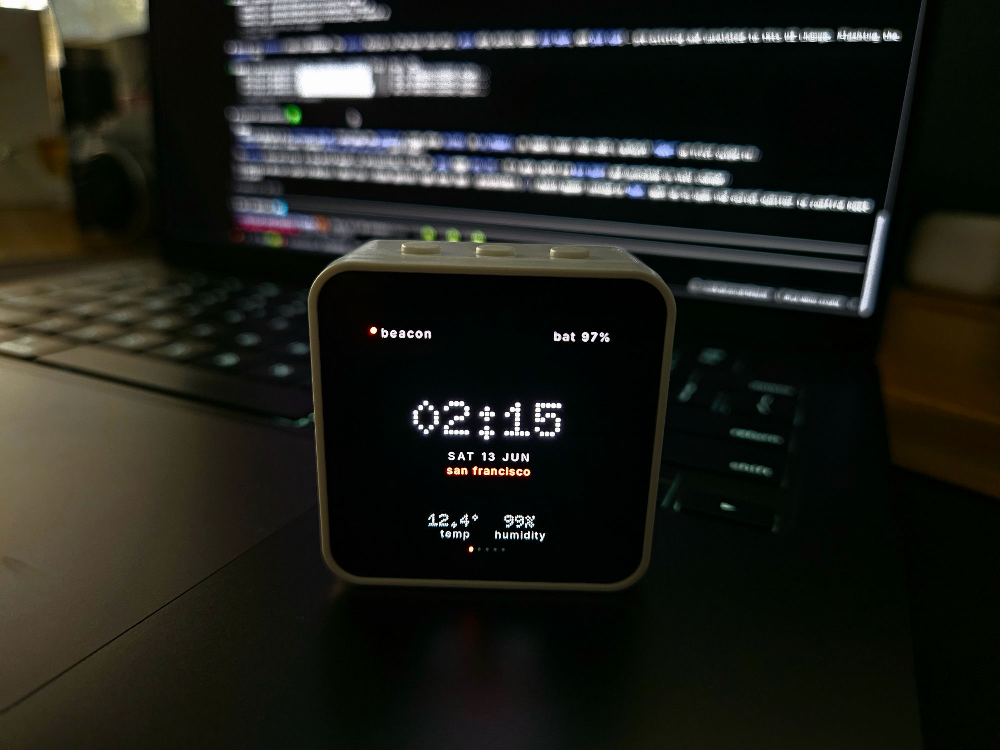

> **Status: early prototype — but it runs on real hardware today.** The device side (all five screens, seven themes, on-device WiFi setup, live weather + markets) and the macOS hub (AI usage + coding buddy over Bluetooth) are both working end-to-end. Expect rough edges and moving parts. See [What works today](#what-works-today).

## What it does

Five screens, navigated by swipe + motion gestures:

| Screen | Shows | Source |
|---|---|---|
| Home | clock, date, weather, humidity | WiFi (direct) |
| Finance | FX, crypto, indices, ETFs — curated from the Mac hub | WiFi (direct) |
| AI Usage | Claude + Codex, **both** 5h and 7-day windows + reset | Mac hub (BLE) |
| Coding Buddy | live per-session list (state + folder·branch + age), approve/deny tool-permission prompts, tap a session to focus its terminal | pluggable agent providers (Claude Code today, Codex CLI landing) via the Mac hub (BLE) |
| Settings | WiFi, brightness, theme picker, sleep, etc. | local (NVS) |

## What works today

- **All five screens render on-device** in 7 bespoke per-theme layouts (35 views), with an honest screen-state model: a value is shown as loading / live / stale / offline — never a guess dressed up as live data.
- **Home + Finance run on live data** over WiFi: NTP/RTC time, Open-Meteo weather (auto-located by IP), FX / BTC / indices.
- **Markets are curated from the hub, no re-flashing** — search Binance + Yahoo in the macOS menubar app, pick your tickers, and they push to the device over BLE and apply instantly (persisted on-device, no reboot, no code change). The device keeps fetching prices itself over WiFi.
- **WiFi setup happens on-device** — the device opens a hotspot with a captive portal; no credentials are ever compiled into the firmware. Multiple networks are remembered.
- **AI Usage is live over Bluetooth**: the macOS hub streams usage from any enabled provider (Claude and Codex built in) to the device over a bonded BLE link, alongside the device's own WiFi plane.
- **Coding Buddy is session-aware, validated on hardware**: the `claude` screen lists live sessions from buddy-enabled providers (state + folder·branch + age, newest first); approve/deny a tool-permission prompt from the device and the Mac honors it; a session waiting on your input shows a **"tap to answer on Mac"** card; **tap any session to focus its terminal** (precise for Warp; repo-window for VS Code/Cursor; app-level otherwise); a distinct chime fires when a session needs you, and the device wakes itself for it. Per-provider **Usage** and **Coding Buddy** toggles live in the hub menubar.
- Settings, theme picker, brightness, and preferences persist across reboots.

## Two-plane architecture

```
   Public internet (direct, WiFi+TLS)          Mac companion hub (BLE)
   - finance / weather / time                   - Claude + Codex usage
                                                - coding buddy (approve/deny)
                                                - holds Claude/Codex secrets; none reach the device
                       \                        /
                        \                      /
                      [ Beacon device: ESP32-S3 + AMOLED ]
```

Private data (your Claude/Codex tokens) lives only on a small macOS hub app and reaches the device over BLE. Public data the device fetches itself over WiFi, so the ambient screens keep working when the Mac is asleep.

## Themes

The UI is fully themeable — **7 themes**, each a bespoke per-screen experience (its own layout in a distinct visual language) composed from shared design tokens (color / type / gauge-style): Editorial Index, Aerospace HUD, **Dot-Matrix** (default), Blueprint, LED Matrix, Oscilloscope, and Analog Neo.

Every theme across all five screens, captured straight from the device framebuffer:

| Theme | Home | Markets | AI Usage | Coding Buddy | Settings |
|---|---|---|---|---|---|
| **Editorial Index** | 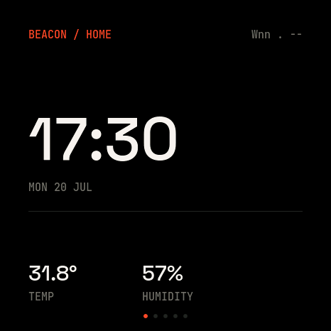 | 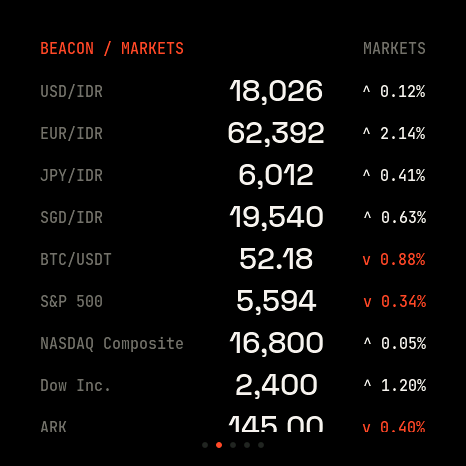 | 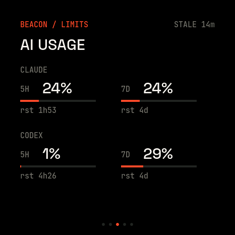 | 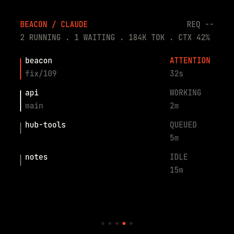 | 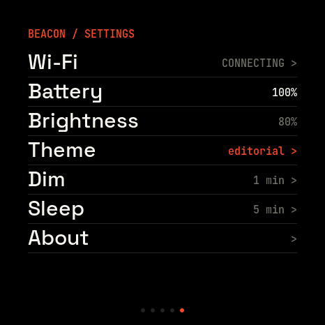 |
| **Aerospace HUD** | 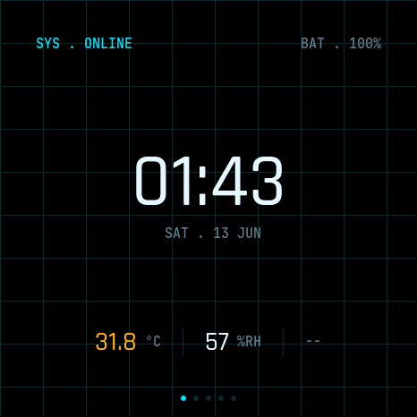 |  | 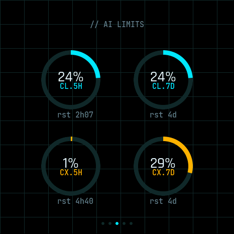 | 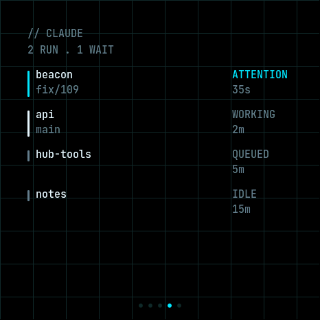 | 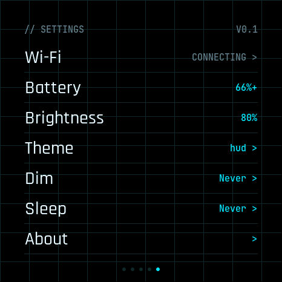 |
| **Dot-Matrix** (default) | 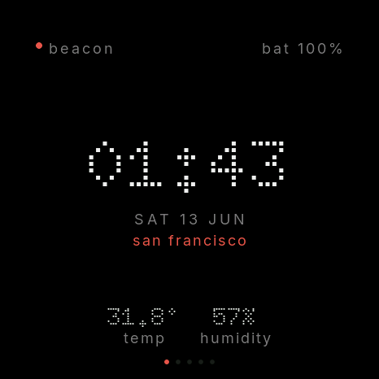 |  | 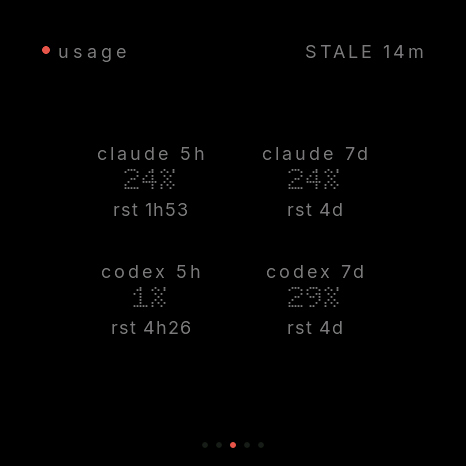 | 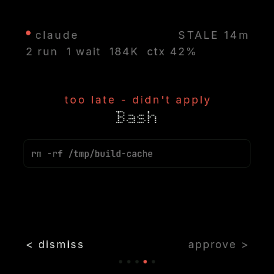 | 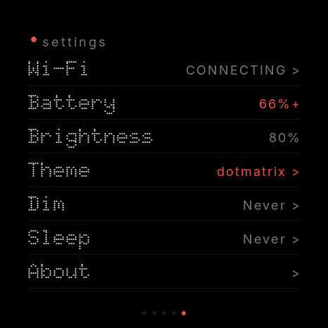 |
| **Blueprint** | 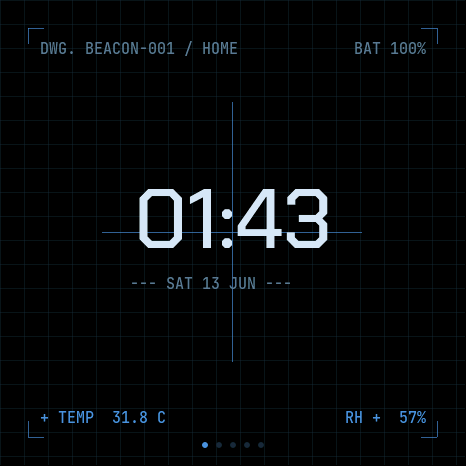 | 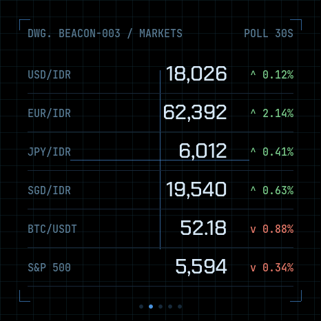 | 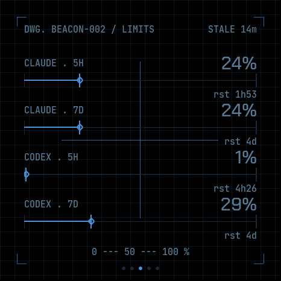 | 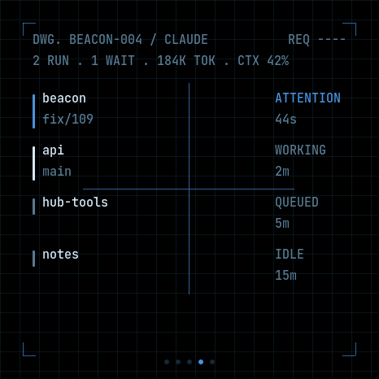 | 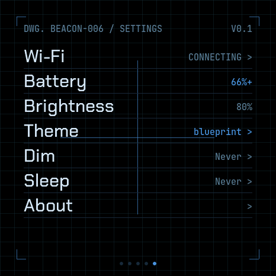 |
| **LED Matrix** | 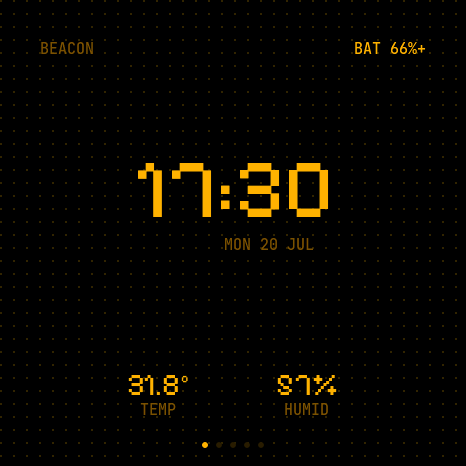 | 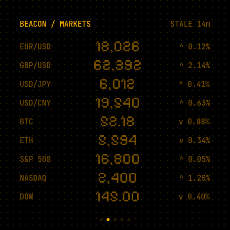 | 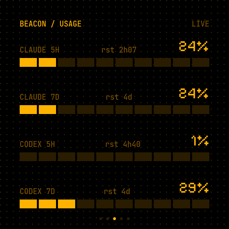 | 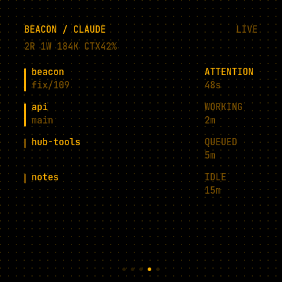 | 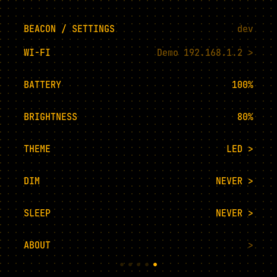 |
| **Oscilloscope** | 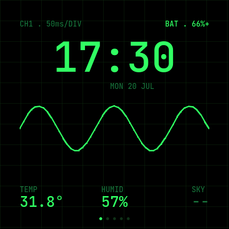 |  | 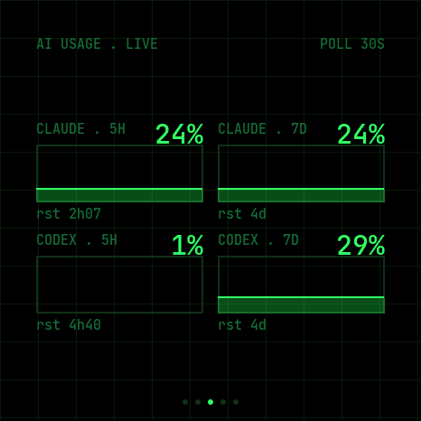 | 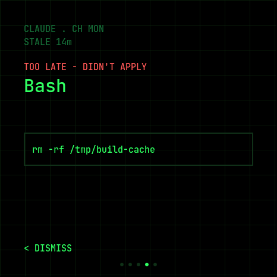 | 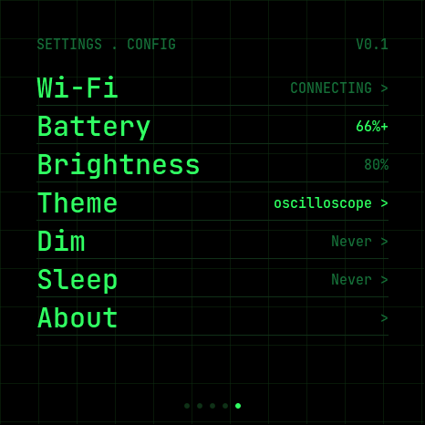 |
| **Analog Neo** | 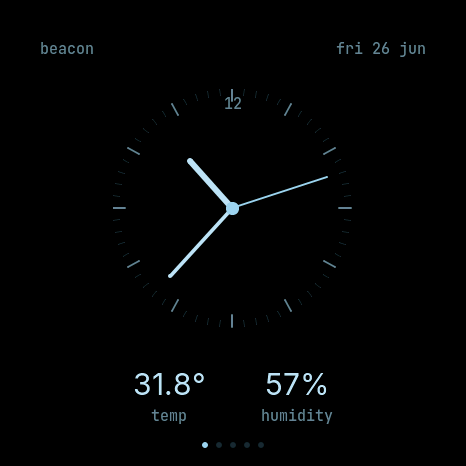 | 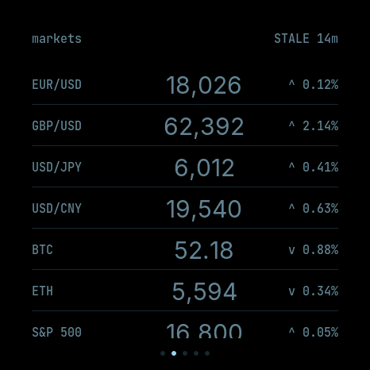 | 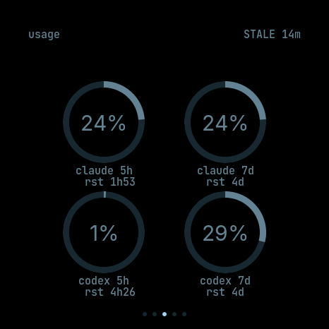 | 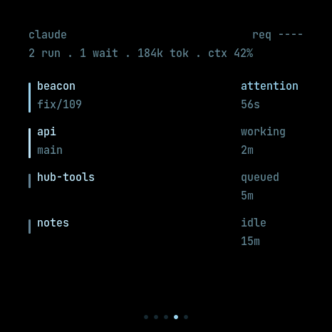 | 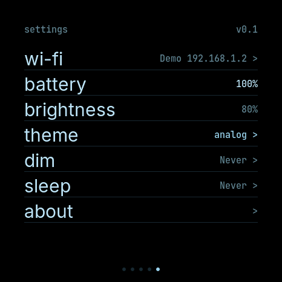 |

**Coding Buddy — three states** (shown in Editorial; every theme renders all three in its own style): the live **session list**, a **permission prompt** (Approve/Deny on the device), and a **question** ("tap to answer on Mac" → focuses that terminal). Each `*_CLAUDE_prompt.png` / `*_CLAUDE_question.png` exists for every theme.

| Session list | Permission prompt | Question (tap to answer) |
|---|---|---|
|  | 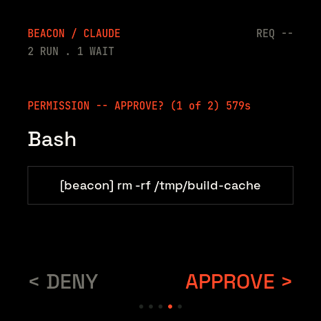 | 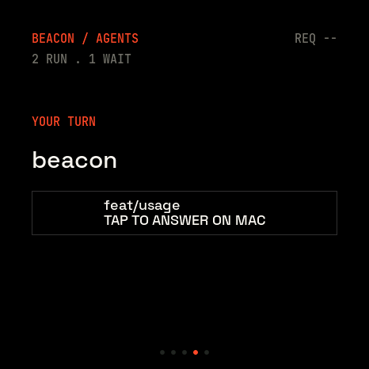 |

[**View the full montage**](docs/assets/screens/montage.png) — all 35 in a single image.

## Get one running

You need the **Waveshare ESP32-S3-Touch-AMOLED-2.16** (around US$30 from Waveshare or the usual resellers), a USB-C **data** cable, and a Mac for the hub features.

1. **Flash the firmware.** Easiest: the [web flasher](https://angaziz.github.io/beacon/) — plug the device in, open the page in Chrome or Edge, click Install. No toolchain needed. Prefer building it yourself? See [`firmware/README.md`](firmware/README.md).
2. **Connect WiFi.** On first boot the device opens a `Beacon-setup` hotspot — join it and the captive portal asks for your network. Everything except AI Usage / Coding Buddy now works.
3. **Add the macOS hub (optional).** AI Usage and Coding Buddy come from a companion app — see [The macOS hub](#the-macos-hub) below. Everything else works without it.

Just validating a fresh board? Flash the bring-up spike first — [`docs/spikes/SETUP.md`](docs/spikes/SETUP.md) covers the Arduino toolchain and the AXP2101 power-rail init the stock demo omits.

## The macOS hub

Beacon Hub is a small macOS menubar app — the device's private-data plane. It reads your Claude Code + Codex usage and bridges Claude Code's tool-permission prompts to the device over a bonded Bluetooth link. Your Claude/Codex credentials stay on the Mac; only normalized percentages, reset times, and prompt text ever cross BLE.

It's also where you **curate the Finance screen**: search Binance + Yahoo from the menubar, pick the tickers you care about, and they sync to the device over BLE and apply on the spot — no firmware edit, no re-flash, no reboot.

Providers are modular: each has independent **Usage** and **Coding Buddy** toggles in the menubar. Disabling Coding Buddy for a provider passes its permission prompts through to the terminal.

### Provider feature parity

Both providers stream AI usage and bridge tool-permission prompts to the device. Claude Code has the richer coding buddy today: its statusline and session host-context feed the hub data that Codex's command hooks don't carry yet.

| Capability | Claude Code | Codex CLI |
|---|---|---|
| AI usage (5h + 7-day windows) | ✅ | ✅ |
| Live session list (state · folder·branch · age) | ✅ | ✅ |
| Approve / deny tool-permission prompts from the device | ✅ | ✅ |
| Auto-deny on device-offline / hub-quit | ✅ | ✅ |
| "Tap to answer on Mac" question card | ✅ | ❌ |
| Tap a session to focus its terminal | ✅ | ❌ |
| Token + context-window readout | ✅ | ❌ |
| Recent-activity feed | ✅ | ❌ |

The Codex gaps are hook-surface limits, not menubar toggles: Codex's command hooks expose no statusline (tokens/context), no host context (terminal focus), and no question event.

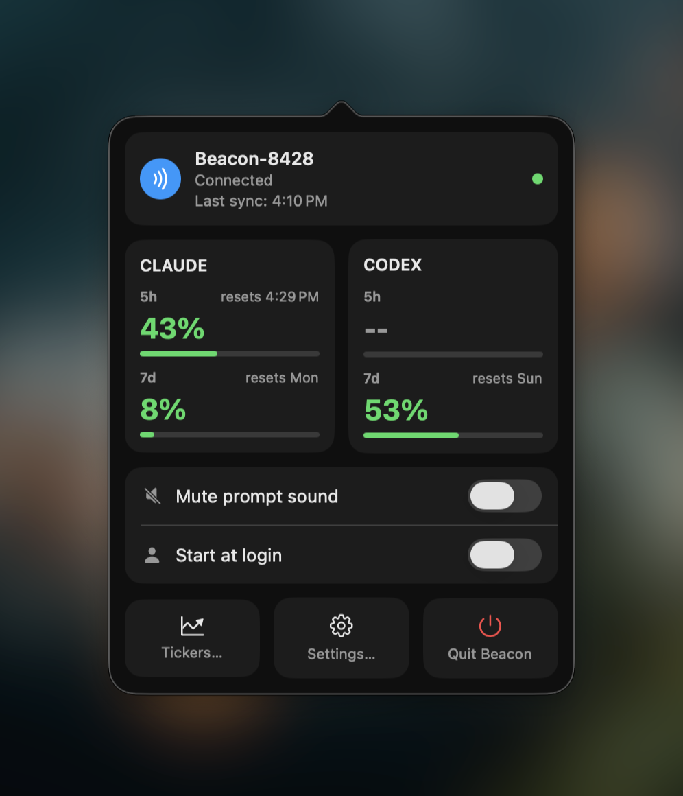

**Requirements.** macOS 13 (Ventura) or later. The prebuilt release is **Apple Silicon only** (arm64); Intel Macs build from source ([`hub/README.md`](hub/README.md)) — SwiftPM compiles for the host architecture.

**Install.** Download `Beacon-Hub-<version>-macos-apple-silicon.zip` from [Releases](https://github.com/angaziz/beacon/releases), unzip, and drag it to Applications. If macOS blocks it on first launch, use the Gatekeeper "Open Anyway" step — full details in [`hub/README.md`](hub/README.md). No release published yet? It builds from source in a few minutes.

**Pair.** Open Beacon Hub; the **Set up Beacon** window walks three checks — Bluetooth permission, device pairing, and a one-click **Install hooks** for Claude Code.

**Permissions.** The hub asks for three on first run. The first two are required for the BLE features; everything else (weather, markets, time) works without the hub.

| Prompt | Why |
|---|---|
| **Bluetooth** | The hub is the BLE central that pairs with the device and streams AI usage + Coding Buddy prompts. Deny it and the hub cannot see the device at all. |
| **Keychain — "Claude Code-credentials"** | Claude Code stores its OAuth token in this Keychain item; the hub reads it to fetch your usage. Choose **Always Allow** to avoid re-prompting on every launch. The token never leaves your Mac — only normalized percentages and reset times go over BLE. |
| **Location** (optional) | A one-shot fix on launch/wake gives the device an accurate place name and time zone. Deny it and the device simply falls back to IP geolocation. |

Codex usage needs no prompt — the hub reads `~/.codex/auth.json` directly. No Local Network, microphone, or accessibility permissions are used.

## Repo layout

```
beacon/
├── PRODUCT.md              # product strategy: users, purpose, principles
├── DESIGN.md               # visual design system + theme tokens (the 7 themes)
├── firmware/               # product firmware (PlatformIO): contracts, theme engine, carousel
│   ├── src/                #   core/ (DataStore, HubLink, records) · hal/ · ui/ (screens, themes)
│   ├── test/               #   native unit tests (contracts, theme, datastore, carousel…)
│   └── flasher.html        #   browser installer (ESP Web Tools), published to GitHub Pages on release
├── hub/                    # macOS menubar hub (SwiftPM): BLE central, usage pollers, buddy bridge
│   ├── Sources/            #   BeaconHubKit (pure logic) + beacon-hub (the menubar agent)
│   ├── Tests/              #   host unit tests
│   └── CONTRACT.md         #   BLE protocol + hub-side policies
└── docs/
    ├── research/           # device + integrations research (hardware, APIs, prior art)
    ├── plans/ · specs/     # implementation plans + design specs
    ├── design/
    │   ├── mockups/        # HTML theme mockups (directions.html)
    │   └── tooling/        # Playwright screenshot helper (shoot.mjs)
    └── spikes/             # hardware spikes (throwaway), organized by topic
```

## Security

- **Never commit WiFi credentials or API tokens.** The spike sketches use placeholder constants you edit locally; `.gitignore` guards against committing credential files. The product firmware needs no secrets at all — WiFi is configured on-device.
- Claude/Codex credentials stay on the macOS hub and never reach the device.

## Built on / thanks

- [Waveshare ESP32-S3-Touch-AMOLED-2.16](https://docs.waveshare.com/ESP32-S3-Touch-AMOLED-2.16) — board, drivers, examples
- [LVGL](https://lvgl.io) · [GFX Library for Arduino](https://github.com/moononournation/Arduino_GFX) · [XPowersLib](https://github.com/lewisxhe/XPowersLib) · [SensorLib](https://github.com/lewisxhe/SensorLib) · ESP32 BLE (the Arduino-ESP32 core `BLE*` wrapper — NimBLE-backed on the pinned esp32s3 libs)
- [ESP Web Tools](https://esphome.github.io/esp-web-tools/) — the browser flasher
- Inspired by: [Clawdmeter](https://github.com/HermannBjorgvin/Clawdmeter), [claude-desktop-buddy-esp32](https://github.com/vthinkxie/claude-desktop-buddy-esp32)

## Disclaimer

Personal, unofficial project. Not affiliated with or endorsed by Anthropic, OpenAI, or Waveshare. Some integrations rely on unofficial/unpublished endpoints that may change or break. Use at your own risk.

## License

[MIT](LICENSE) © 2026 Anggie Aziz
