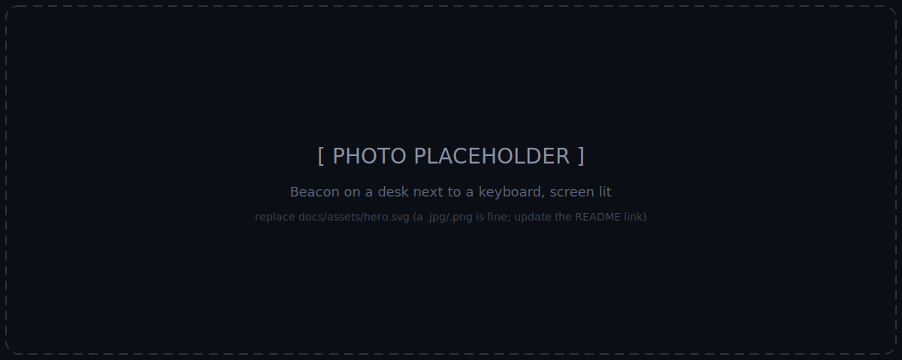
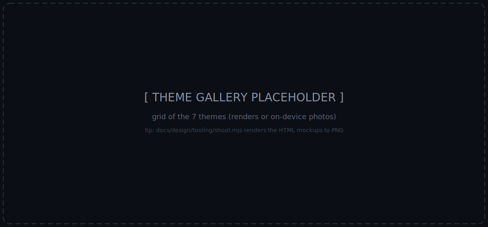

# Beacon

[](https://github.com/angaziz/beacon/actions/workflows/ci.yml)
[](https://github.com/angaziz/beacon/releases)
[](LICENSE)

A dark, futuristic desk command-center on a 2.16" AMOLED touch device — built on the **Waveshare ESP32-S3-Touch-AMOLED-2.16**. It sits next to your keyboard and, at a glance, shows your Claude Code / Codex usage, live markets, weather, and a Claude coding "buddy" you can approve tool-prompts on — without breaking focus on your Mac.


<!-- TODO(photo): replace docs/assets/hero.svg with a real desk photo (jpg/png), update this link -->

> **Status: early prototype — but it runs on real hardware today.** The device side (all five screens, seven themes, on-device WiFi setup, live weather + markets) and the macOS hub (AI usage + coding buddy over Bluetooth) are both working end-to-end. Expect rough edges and moving parts. See [What works today](#what-works-today).

## What it does

Five screens, navigated by swipe + motion gestures:

| Screen | Shows | Source |
|---|---|---|
| Home | clock, date, weather, humidity | WiFi (direct) |
| Finance | configurable FX->IDR, crypto, indices, ETFs | WiFi (direct) |
| AI Usage | Claude + Codex, **both** 5h and 7-day windows + reset | Mac hub (BLE) |
| Coding Buddy | session state + approve/deny Claude tool-permission prompts | Mac hub (BLE) |
| Settings | WiFi, brightness, theme picker, sleep, etc. | local (NVS) |

## What works today

- **All five screens render on-device** in 7 bespoke per-theme layouts (35 views), with an honest screen-state model: a value is shown as loading / live / stale / offline — never a guess dressed up as live data.
- **Home + Finance run on live data** over WiFi: NTP/RTC time, Open-Meteo weather (auto-located by IP), FX->IDR / BTC / indices.
- **WiFi setup happens on-device** — the device opens a hotspot with a captive portal; no credentials are ever compiled into the firmware. Multiple networks are remembered.
- **AI Usage is live over Bluetooth**: the macOS hub reads Claude Code + Codex usage and streams it to the device over a bonded BLE link, alongside the device's own WiFi plane.
- **Coding Buddy round-trip is validated on hardware**: approve or deny a Claude Code tool-permission prompt from the device, and the Mac honors it.
- Settings, theme picker, brightness, and preferences persist across reboots.

## Two-plane architecture

```
   Public internet (direct, WiFi+TLS)          Mac companion hub (BLE)
   - finance / weather / time                   - Claude + Codex usage
                                                - coding buddy (approve/deny)
                                                - holds Claude/Codex secrets; none reach the device
                       \                        /
                        \                      /
                      [ Beacon device: ESP32-S3 + AMOLED ]
```

Private data (your Claude/Codex tokens) lives only on a small macOS hub app and reaches the device over BLE. Public data the device fetches itself over WiFi, so the ambient screens keep working when the Mac is asleep.

## Themes

The UI is fully themeable — **7 themes**, each a bespoke per-screen experience (its own layout in a distinct visual language) composed from shared design tokens (color / type / gauge-style): **Editorial Index** (default), Aerospace HUD, Dot-Matrix, Blueprint, LED Matrix, Oscilloscope, and Analog Neo.


<!-- TODO(photo): replace docs/assets/themes.svg with a grid of theme renders or photos -->

Interactive mockups of all seven live in [`docs/design/mockups/directions.html`](docs/design/mockups/directions.html) (clone the repo and open it in a browser — GitHub does not render HTML files).

## Get one running

You need the **Waveshare ESP32-S3-Touch-AMOLED-2.16** (around US$30 from Waveshare or the usual resellers), a USB-C **data** cable, and a Mac for the hub features.

1. **Flash the firmware.** Easiest: the [web flasher](https://angaziz.github.io/beacon/) — plug the device in, open the page in Chrome or Edge, click Install. No toolchain needed. Prefer building it yourself? See [`firmware/README.md`](firmware/README.md).
2. **Connect WiFi.** On first boot the device opens a `Beacon-setup` hotspot — join it and the captive portal asks for your network. Everything except AI Usage / Coding Buddy now works.
3. **Install the hub (macOS).** Download `Beacon-Hub-<version>.zip` from [Releases](https://github.com/angaziz/beacon/releases), unzip, drag to Applications. Install and pairing details (including the Gatekeeper "Open Anyway" step — the app is not notarized): [`hub/README.md`](hub/README.md).
4. **Pair.** Open Beacon Hub; the **Set up Beacon** window walks three checks — Bluetooth permission, device pairing, and a one-click **Install hooks** for Claude Code.

If there is no release published yet, both pieces build from source in a few minutes: [`firmware/README.md`](firmware/README.md) and [`hub/README.md`](hub/README.md).

### macOS permissions

Beacon Hub asks for three permissions on first run. The first two are required for the BLE features; everything else (weather, markets, time) works without the hub.

| Prompt | Why |
|---|---|
| **Bluetooth** | The hub is the BLE central that pairs with the device and streams AI usage + Coding Buddy prompts. Deny it and the hub cannot see the device at all. |
| **Keychain — "Claude Code-credentials"** | Claude Code stores its OAuth token in this Keychain item; the hub reads it to fetch your usage. Choose **Always Allow** to avoid re-prompting on every launch. The token never leaves your Mac — only normalized percentages and reset times go over BLE. |
| **Location** (optional) | A one-shot fix on launch/wake gives the device an accurate place name and time zone. Deny it and the device simply falls back to IP geolocation. |

Codex usage needs no prompt — the hub reads `~/.codex/auth.json` directly. No Local Network, microphone, or accessibility permissions are used.

Just validating a fresh board? Flash the bring-up spike first — [`docs/spikes/SETUP.md`](docs/spikes/SETUP.md) covers the Arduino toolchain and the AXP2101 power-rail init the stock demo omits.

## Repo layout

```
beacon/
├── PRODUCT.md              # product strategy: users, purpose, principles
├── DESIGN.md               # visual design system + theme tokens (the 7 themes)
├── firmware/               # product firmware (PlatformIO): contracts, theme engine, carousel
│   ├── src/                #   core/ (DataStore, HubLink, records) · hal/ · ui/ (screens, themes)
│   ├── test/               #   native unit tests (contracts, theme, datastore, carousel…)
│   └── flasher.html        #   browser installer (ESP Web Tools), published to GitHub Pages on release
├── hub/                    # macOS menubar hub (SwiftPM): BLE central, usage pollers, buddy bridge
│   ├── Sources/            #   BeaconHubKit (pure logic) + beacon-hub (the menubar agent)
│   ├── Tests/              #   host unit tests
│   └── CONTRACT.md         #   BLE protocol + hub-side policies
└── docs/
    ├── research/           # device + integrations research (hardware, APIs, prior art)
    ├── plans/ · specs/     # implementation plans + design specs
    ├── design/
    │   ├── mockups/        # HTML theme mockups (directions.html)
    │   └── tooling/        # Playwright screenshot helper (shoot.mjs)
    └── spikes/             # hardware spikes (throwaway), organized by topic
```

## Roadmap

The full phased plan — requirements, acceptance, dependencies — lives in [`docs/prd.md`](docs/prd.md) §7.

## Security

- **Never commit WiFi credentials or API tokens.** The spike sketches use placeholder constants you edit locally; `.gitignore` excludes `secrets.h` / `.env` style files. The product firmware needs no secrets at all — WiFi is configured on-device.
- Claude/Codex credentials stay on the macOS hub and never reach the device.

## Built on / thanks

- [Waveshare ESP32-S3-Touch-AMOLED-2.16](https://docs.waveshare.com/ESP32-S3-Touch-AMOLED-2.16) — board, drivers, examples
- [LVGL](https://lvgl.io) · [GFX Library for Arduino](https://github.com/moononournation/Arduino_GFX) · [XPowersLib](https://github.com/lewisxhe/XPowersLib) · [SensorLib](https://github.com/lewisxhe/SensorLib) · ESP32 BLE (the Arduino-ESP32 core `BLE*` wrapper — NimBLE-backed on the pinned esp32s3 libs)
- [ESP Web Tools](https://esphome.github.io/esp-web-tools/) — the browser flasher
- Prior art that informed the design: [Clawdmeter](https://github.com/HermannBjorgvin/Clawdmeter), [claude-desktop-buddy-esp32](https://github.com/vthinkxie/claude-desktop-buddy-esp32)

## Disclaimer

Personal, unofficial project. Not affiliated with or endorsed by Anthropic, OpenAI, Spotify, or Waveshare. Some integrations rely on unofficial/unpublished endpoints that may change or break. Use at your own risk.

## License

[MIT](LICENSE) © 2026 Anggie Aziz
