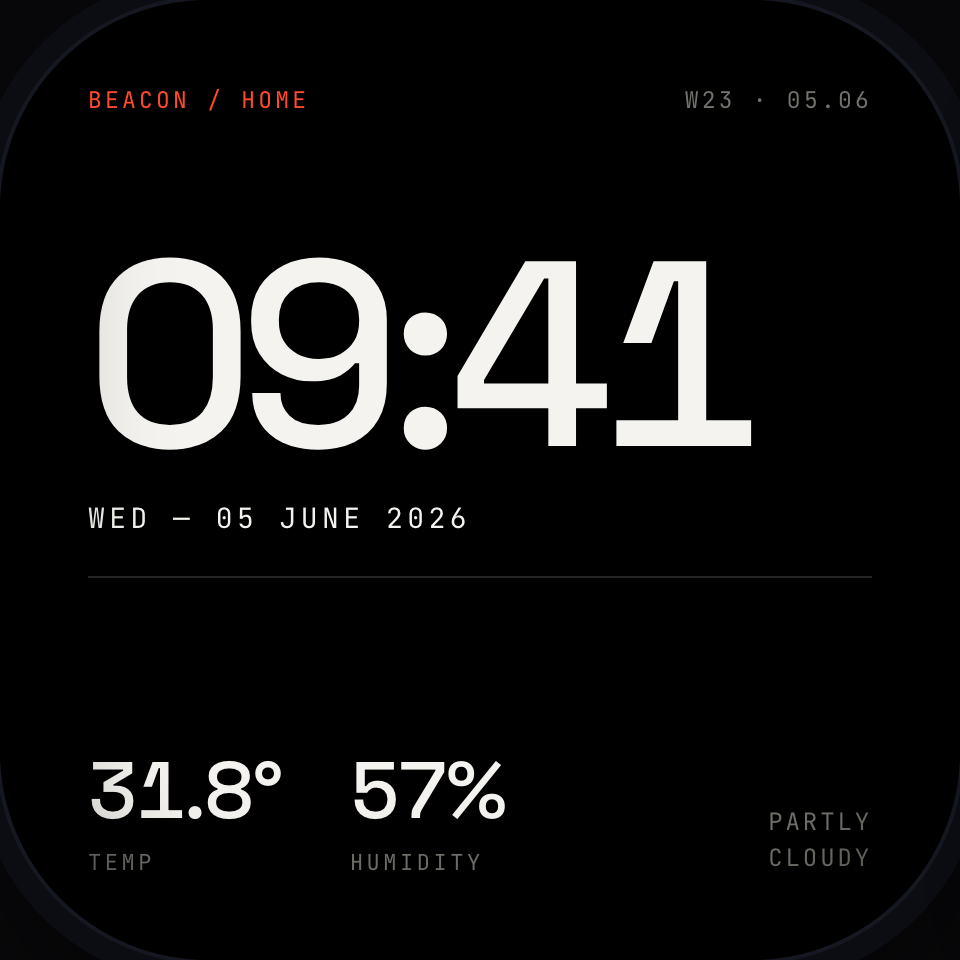
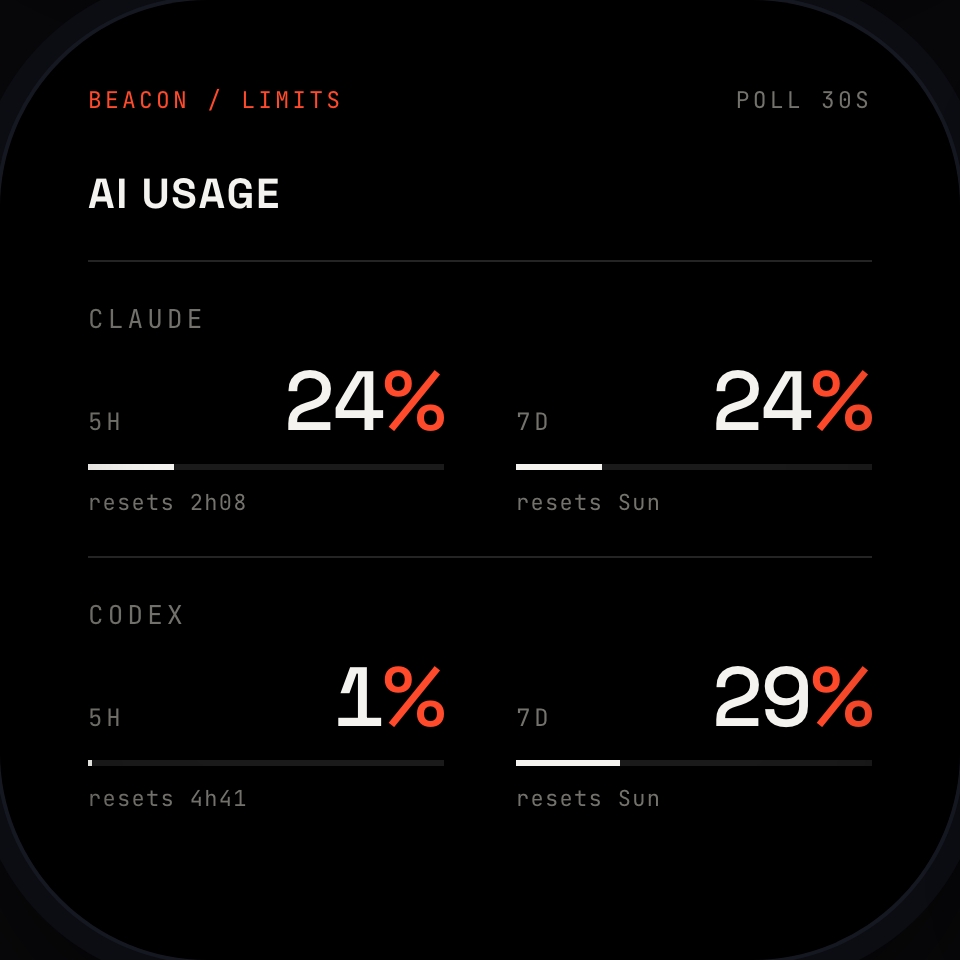
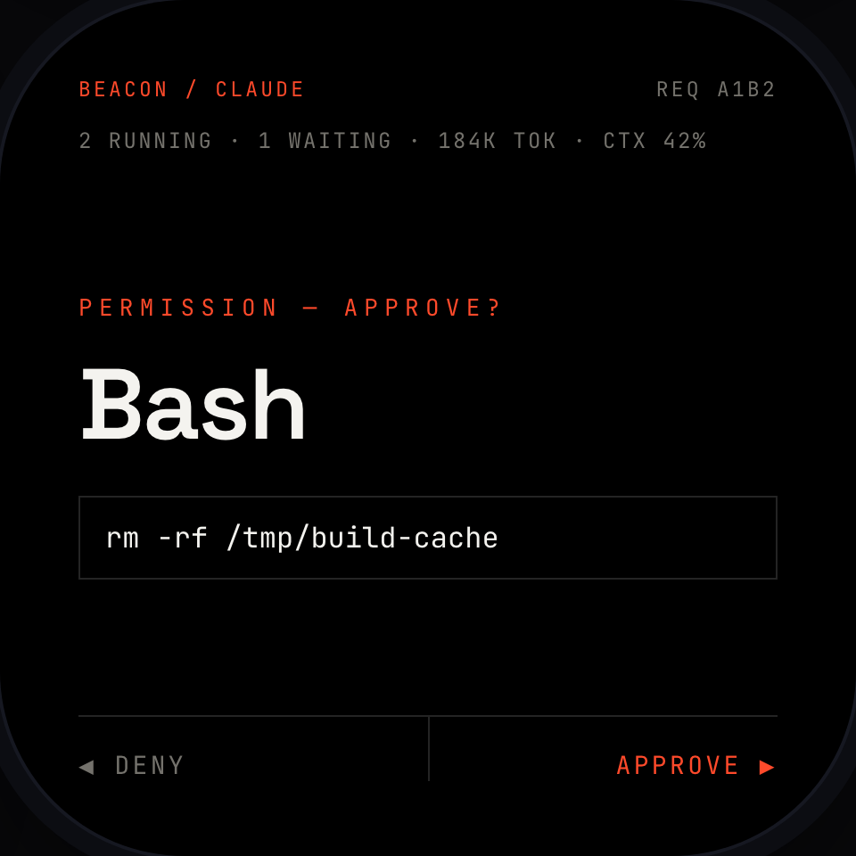

# Beacon

A dark, futuristic desk command-center on a 2.16" AMOLED touch device — built on the
**Waveshare ESP32-S3-Touch-AMOLED-2.16**. It sits next to your keyboard and, at a glance,
shows your Claude Code / Codex usage, live markets, weather, music, and a Claude coding
"buddy" you can approve tool-prompts on — without breaking focus on your Mac.

> **Status: early / prototype.** Hardware bring-up (display + power + touch + WiFi/BLE
> coexistence) is proven, the specs are written, and **P0 foundation is largely built**: the
> swipe carousel + all six screens render on-device in **7 bespoke themes**, on the frozen
> DataStore + theme engine. Persistence (NVS), WiFi provisioning, and the time service (P0-D)
> are next; live data fetchers come in P1/P2/P4. Expect things to move. See [Roadmap](#roadmap).

<p>
  
  
  
</p>

<sub>Design renders of the **Editorial** theme (1 of 7). On device, each theme renders these screens
in its own visual language — see the full gallery in
[`docs/design/mockups/directions.html`](docs/design/mockups/directions.html).</sub>

## What it does

Six screens, navigated by swipe + motion gestures:

| Screen | Shows | Source |
|---|---|---|
| Home | clock, date, weather, humidity | WiFi (direct) |
| Finance | configurable FX→IDR, crypto, indices, ETFs | WiFi (direct) |
| AI Usage | Claude + Codex, **both** 5h and 7-day windows + reset | Mac hub (BLE) |
| Coding Buddy | session state + approve/deny Claude tool-permission prompts + launch tasks | Mac hub (BLE) |
| Now-Playing | Spotify control (remote for an active Connect device) | WiFi (direct) |
| Settings | WiFi, brightness, theme picker, tickers, etc. | local (NVS) |

## Two-plane architecture

```
   Public internet (direct, WiFi+TLS)          Mac companion hub (BLE)
   - finance / weather / time                   - Claude + Codex usage
   - Spotify control                            - coding buddy (approve/deny, launch)
   - Hermes agent (device -> VPS)               - holds Claude/Codex secrets; none reach the device
                       \                        /
                        \                      /
                      [ Beacon device: ESP32-S3 + AMOLED ]
```

Private data (your Claude/Codex tokens) lives only on a small macOS hub app and reaches the
device over BLE. Public data the device fetches itself over WiFi, so the ambient screens keep
working when the Mac is asleep.

## Themes

The UI is fully themeable — **7 themes**, each a **bespoke per-screen experience** (its own layout
in a distinct visual language) composed from shared design tokens (color / type / gauge-style) +
per-theme background chrome; default **Editorial Index**. The seven: Editorial Index, Aerospace HUD,
Dot-Matrix, Blueprint, LED Matrix, Oscilloscope, Analog Neo. See the full gallery at
[`docs/design/mockups/directions.html`](docs/design/mockups/directions.html) (open in a browser) or the
rendered previews under [`docs/design/mockups/shots/`](docs/design/mockups/shots/).

## Repo layout

```
beacon/
├── PRODUCT.md              # product strategy: users, purpose, principles
├── DESIGN.md               # visual design system + theme tokens (the 7 themes)
└── docs/
    ├── research/           # device + integrations research (hardware, APIs, prior art)
    ├── design/
    │   ├── mockups/        # HTML theme mockups + rendered PNG previews (shots/)
    │   └── tooling/        # Playwright screenshot helper (shoot.mjs)
    └── spikes/             # hardware spikes (throwaway), organized by topic
        ├── README.md       # index + outcomes
        ├── SETUP.md        # Arduino toolchain + flashing/troubleshooting
        ├── display-power/          # AXP2101 power + CO5300 display bring-up
        └── wifi-ble-coexistence/   # WiFi + BLE + HTTPS coexistence test
```

The product firmware will live under a top-level `firmware/` once the build phase starts; `docs/spikes/` keeps the exploratory experiments separate from it.

## Getting started (hardware)

You'll need the Waveshare **ESP32-S3-Touch-AMOLED-2.16** and a USB-C **data** cable.
Full toolchain + library setup is in **[`docs/spikes/SETUP.md`](docs/spikes/SETUP.md)**.
Short version: Arduino IDE 2.x + the `esp32` core (3.3.x), the Waveshare libraries +
`lv_conf.h`, board = *ESP32S3 Dev Module* with **PSRAM: OPI PSRAM** and **Flash: 16MB**.

Start by flashing `docs/spikes/display-power/beacon_power_test` — it powers the display
correctly (the AXP2101 rail init the stock demo omits) and confirms your board.

## Roadmap

The full phased plan (requirements, acceptance, dependencies) is in [`docs/prd.md`](docs/prd.md) §7; this is the short version.

- [x] Device + integrations research; hardware capability map
- [x] Design system + 7 themes (Editorial default)
- [x] Hardware spike: AXP2101 power + CO5300 display bring-up
- [x] Hardware spike: WiFi + BLE coexistence + memory headroom
- [x] Functional PRD + technical constitution ([`docs/prd.md`](docs/prd.md), [`docs/tech.md`](docs/tech.md))
- [ ] **P0 — Foundation**: LVGL shell, swipe carousel, theme engine, settings, time service, and the frozen shared contracts (DataStore, HubLink, `SAFE_INSET`, partitions)
- [ ] **P1 — Ambient screens**: Home, Finance (+ full screen-state model)
- [ ] **P2 — Hub + AI**: macOS hub app (Swift) + AI Usage + Coding Buddy over BLE
- [ ] **P3 — Input polish**: IMU + touch gestures
- [ ] **P4 — Now-Playing**: Spotify control
- [ ] **Explore**: Hermes agent, voice

## Security

- **Never commit WiFi credentials or API tokens.** The spike sketches use placeholder
  constants you edit locally; `.gitignore` excludes `secrets.h` / `.env` style files.
- Claude/Codex credentials are designed to stay on the macOS hub and never reach the device.

## Built on / thanks

- [Waveshare ESP32-S3-Touch-AMOLED-2.16](https://docs.waveshare.com/ESP32-S3-Touch-AMOLED-2.16) — board, drivers, examples
- [LVGL](https://lvgl.io) · [GFX Library for Arduino](https://github.com/moononournation/Arduino_GFX) · [XPowersLib](https://github.com/lewisxhe/XPowersLib) · [SensorLib](https://github.com/lewisxhe/SensorLib) · ESP32 BLE (Bluedroid, in the Arduino-ESP32 core)
- Prior art that informed the design: [Clawdmeter](https://github.com/HermannBjorgvin/Clawdmeter), [claude-desktop-buddy-esp32](https://github.com/vthinkxie/claude-desktop-buddy-esp32)

## Disclaimer

Personal, unofficial project. Not affiliated with or endorsed by Anthropic, OpenAI, Spotify,
or Waveshare. Some integrations rely on unofficial/unpublished endpoints that may change or
break. Use at your own risk.

## License

[MIT](LICENSE) © 2026 Anggie Aziz
